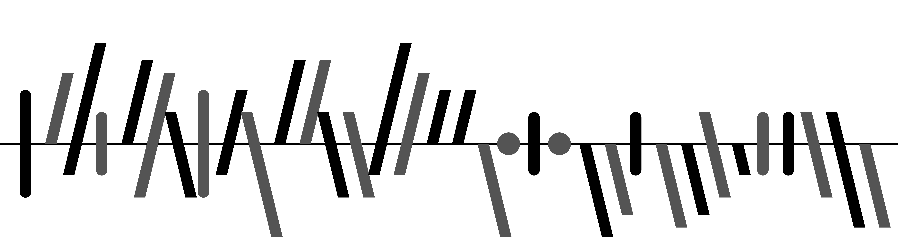

# soccerbars 

<!-- badges: start -->
[](https://github.com/meakbiyik/soccerbars/actions)
[](https://github.com/meakbiyik/soccerbars/actions)
<!-- To include when the repo becomes public.
[](https://codecov.io/gh/meakbiyik/soccerbars?branch=master)
-->
<!-- badges: end -->

Multivariate sparklines making use of Gestalt theory (gestaltlines) for sequences of sports results.

This repository contains a Python package, an R package, and a cmd tool based on Python.

Soccerbars is created by Prof. Dr. Ulrik Brandes of ETH Zürich and this repository is a port of his [LaTeX package](https://github.com/ubrandes-ethz/soccerbars). An introduction to the theory behind this work can be found [here](https://sn.ethz.ch/research/soccerbars.html).

## Usage

The signature of the main function `soccerbar` is identical in both Python and R implementations. The input (`scores` argument) can be either a list of matches in the form ```(home_team_score: integer, away_team_score: integer, away_game: boolean)```, a list of three same-length score lists with the same types as the previous scheme, or common data frame objects of each language (`pandas.DataFrame` in Python and `data.frame` in R). A list of these entities can also be given as input if multiple leagues/tournaments are wanted to be plotted.

Both languages preserve the flags and the `color` arguments from the LaTeX package, and also expose a series of common parameters as keyword arguments. `output_path` and `show` arguments can be used to determine whether the call is to save the resulting image to the given path(s), or just to show it via the available graphical interface (not possible in Python if the function is called from the command line). In both cases, the functions return the plotted objects (`matplotlib.Axes` object(s) in Python and `ggplot` object(s) in R).

For `color` and `output_path` arguments, the function expects the structure of these to be consistent with the `scores` argument: if multiple lists of match lists are given, then for each such list an output path and a list of colors must be specified, therefore the lengths must be equal in all levels. These arguments are optional, when not provided the configuration will use the LaTeX defaults. Also, the `color` argument should not be necessary in most cases, as the color-related keyword arguments provide sufficient flexibility with much easier usage in both languages (see [Parameters](#parameters) below for more details).

### in Python

Give the matches to the ```soccerbar``` function as an iterable of matches in row-wise, column-wise or DataFrame format. A list of values following these formats (e.g. in the context of multiple leagues) are also accepted without mixing.

```python
from soccerbars import soccerbar

# Row-wise format
soccerbar([
    (1, 2, True), (3, 4, False), (5, 6, True), (7, 8, False)
])
# Column-wise format
soccerbar([
    (1, 3, 5, 7), 
    (2, 4, 6, 8), 
    (True, False, True, False)
], outlined=True, output_path="matches.png")
# List of row-wise inputs: observe that both color and output_path
# parameters match with the scores
soccerbar([
    [(1, 2, True), (3, 4, False)], 
    [(5, 6, True), (7, 8, False)]
    ],
    color=[("r", "b"), ("g", "y")],
    output_path=["league1.png", "league2.png"]
)
# Input as pandas DataFrame
import pandas as pd

soccerbar(pd.DataFrame([
    (1, 2, True), (3, 4, False), (5, 6, True), (7, 8, False)
]), home_color="red")
```

### in R

Similarly with its Python counterpart, ```soccerbar``` admits both list of match score lists, and a list of three vectors, along with `data.frame` objects. A list of these (e.g. in the context of multiple leagues) are also allowed.

```R
library(soccerbars)

# Row-wise format
soccerbar(list(
    list(1, 2, TRUE), list(3, 4, FALSE), list(5, 6, TRUE), list(7, 8, FALSE)
))
# Column-wise (vector) format
soccerbar(list(
    c(1, 3, 5, 7),
    c(2, 4, 6, 8),
    c(TRUE, FALSE, TRUE, FALSE)
), outlined = TRUE, output_path = "matches.png")
# List of column-wise inputs: observe that both color and output_path
# parameters match with the scores
soccerbar(list(
    list(c(1, 3), c(2, 4), c(TRUE, FALSE)), 
    list(c(5, 7), c(6, 8), c(TRUE, FALSE))
    ),
    color = list(c("red", "blue"), c("green", "yellow")),
    output_path = c("league1.png", "league2.png")
)
# Input as data.frame object
soccerbar(data.frame(
    c(1, 3, 5, 7),
    c(2, 4, 6, 8),
    c(TRUE, FALSE, TRUE, FALSE)
), home_color = "red")
```

### via CLI

After installing the package (see the instructions [below](#as-a-command-line-tool)), navigate into the folder and run

```bash
poetry run soccerbars --help
```

to see the available options. The CLI is a thin wrapper around the Python API, and writes the output image to the specified location with the `--output-path` argument. Input syntax is identical with the LaTeX package. In addition to the capabilities of the Python core, CLI can also admit a glob pattern to match with `.csv` files.

```bash
# Vanilla usage
poetry run soccerbars "(1-2) (3-1)* (2-2)"
# Specifying the output path (default is "output.png")
poetry run soccerbars -o out.tiff "(1-2) (3-1)* (2-2)"
# Reading from a .csv file and specifying an output file
poetry run soccerbars matches.csv -o matches.pdf
# Reading from a glob of csv files and saving the output images to a directory
poetry run soccerbars *.csv -o ".\output-dir"
# `-t`, `-z`, `-ol` flags stand for twogoalline, zerodots and outlined options
# `-p` option can be used to specify additional parameters with syntax key:value
poetry run soccerbars -z -ol -p fill_color:"(1,1,1,1)" -p home_color:red *.csv
```

### Parameters

These parameters can be used to customize the output images in all components.

| Parameter | Description | Default |
|-|-|-|
| dpi | Dots per inch resolution | 300 |
| thickness | Line thickness in cartesian coordinates | 0.18 |
| edge_thickness  | Edge thickness for outlined patches (when outlined=True) as the ratio to the line thickness | 0.35 |
| goalless_edge_thickness  | Edge thickness for outlined no-goal patches (when outlined=True) as the ratio to the line thickness | 0.5 |
| zerodot | Zero-dot diameter ratio to thickness (when zerodots=True) | 0.6 |
| slant | Slope for unbalanced scores in degrees | 14 |
| spacing | Spacing between matches in cartesian coordinates | 0.9 |
| padding | Padding before and after the matches in cartesian coordinates | 0.2 |
| baseline_factor | Thickness of baseline with respect to line thickness | 0.2 |
| away_brighter | Set away game colors 33% brighter (when outlined=False) | True |
| away_darker | Set away game colors 33% darker (when outlined=False, setting this flag will turn "away_brighter" off) | False |
| transparent_background | Set the background transparent instead of white | False |
| home_color | Color of home match lines (in Python: matplotlib-acceptable formats, in R: any of the three kinds of R color specifications; either a color name as listed by colors(), a hexadecimal string of the form "#rrggbb" or "#rrggbbaa", or a positive integer i meaning `palette()[i]`) | #000000FF |
| away_color | Color of away match lines | #000000FF |
| baseline_color | Color of baselines | #000000FF |
| fill_color | Fill color for the outlined sparklines | #00000000 |
| clip_slanted_lines | Clip the ends of the slanted lines | True |

## Installation

This package is not published in PyPI or CRAN yet, so you can use the git-compatible installation tools of each language.

### As a Python package

```bash
pip install git+https://github.com/meakbiyik/soccerbars.git 
```

### As an R package

```R
devtools::install_github("meakbiyik/soccerbars")
```

### As a command line tool

1. Install Python from [here](https://www.python.org/downloads/)
2. Install [Poetry](https://python-poetry.org/), a dependency management tool for Python, via the following command

    ```bash
    curl -sSL https://raw.githubusercontent.com/python-poetry/poetry/master/get-poetry.py | python
    ```

3. Clone this repository to your local, navigate into the folder and run

    ```bash
    poetry install --no-dev --extras cli
    ```
